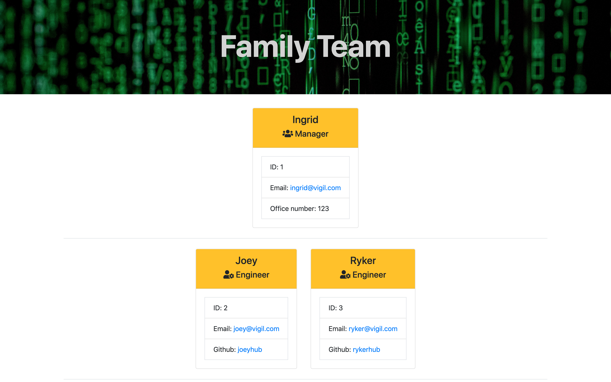
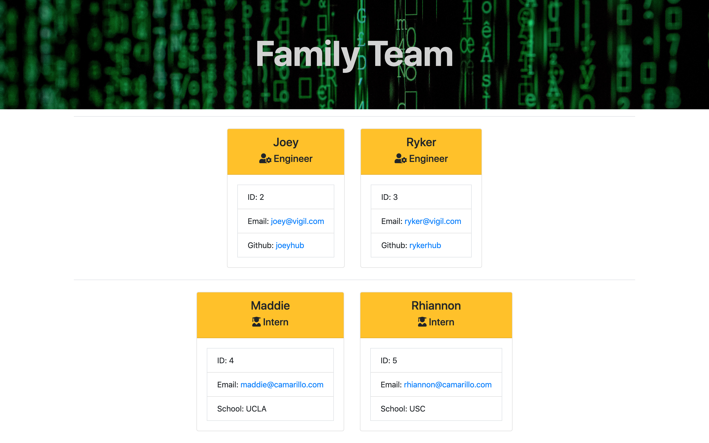

# Team-Engine-Summary

This command line application builds a team of software enginners in HTML. The user can input the following information:
For all employees:

* name
* id
* email 
* office number (managers only)
* github username (engineers only)
* school (interns only)

## Technologies used

Jest (testing) - HTML - CSS - Bootstrap - Javascript - Inquirer

